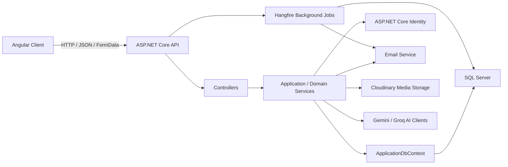
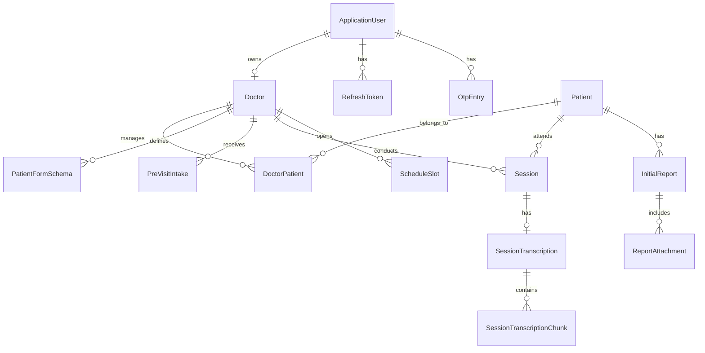

# PhysioAssist Existing Architecture Review

## 1. Executive Summary

PhysioAssist is structured as a full-stack application with:

- An ASP.NET Core Web API backend in `PhysioAssist.Api`.
- An Angular frontend in `Client`.
- SQL Server persistence through Entity Framework Core.
- ASP.NET Core Identity for users, roles, login, email confirmation, password reset, and refresh tokens.
- Modular backend folders for Auth, Patient, Intake, Scheduling, Session, and Initial Report domains.
- Shared infrastructure for authorization, email, media storage, AI transcription, validation, mapping, background jobs, and result/error handling.

The backend currently follows a modular-monolith style: one deployable API project, one database context, and module folders grouped by business capability. This is a practical architecture for an early product because it keeps deployment simple while still encouraging feature boundaries.

The frontend is still a thin Angular shell. It has routing, global HTTP interceptors, PrimeNG setup, loading/error UI components, and test/demo feature pages. It does not yet mirror the backend domain modules with complete feature experiences.

## 2. High-Level System Shape



The main runtime flow is:

1. Angular sends requests to API endpoints.
2. Controllers validate and delegate behavior to services.
3. Services coordinate Identity, EF Core, external services, and domain rules.
4. Results are returned through a shared `Result` pattern and converted to HTTP responses.
5. Long-running or delayed work, such as sending email, is queued through Hangfire.

## 3. Backend Architecture

### 3.1 API Host and Composition Root

The backend starts in `PhysioAssist.Api/Program.cs`.

Responsibilities:

- Adds controllers.
- Registers global services through `AddGlobalServicesRegistration`.
- Enables Swagger in development.
- Enables HTTPS redirection.
- Enables CORS policy named `AllowAngular`.
- Enables authentication and authorization.
- Enables Hangfire dashboard at `/jobs`.
- Maps controllers.
- Runs seed logic through `DataSeeder.SeedAsync`.

The main dependency composition is centralized in `PhysioAssist.Api/DependancyInjection.cs`.

It registers:

- Swagger.
- HTTP context accessor.
- FluentValidation auto-validation.
- Mapster mapping.
- Permission-based authorization.
- Email settings and email service.
- EF Core SQL Server context.
- CORS.
- Cloudinary media hosting.
- Audio transcription clients.
- Hangfire background jobs.
- Auth module services.

This creates a clear composition root, but most module-level registration is still global. Auth has its own module registration; other modules currently do not.

### 3.2 Modular Monolith Organization

The backend uses business module folders under `PhysioAssist.Api/Modules`:

- `Auth`
- `PatientModule`
- `Intake`
- `Scheduling`
- `SessionModule`
- `InitialReportModule`

Each module mostly contains:

- Domain entities.
- EF Core entity configurations.
- Contracts, services, controllers, and mapping where implemented.

Current maturity by module:

| Module | Current Implementation Level |
| --- | --- |
| Auth | Most complete: controller, service, contracts, validators, JWT provider, mapping, entities, EF config |
| Patient | Entities and EF configuration |
| Intake | Entities and EF configuration |
| Scheduling | Entity and EF configuration |
| Session | Entities and EF configuration |
| Initial Report | Entities and EF configuration |

The architecture is ready for vertical module growth, but only the Auth module currently has full request-to-database behavior.

## 4. Persistence Architecture

### 4.1 ApplicationDbContext

`ApplicationDbContext` inherits from `IdentityDbContext<ApplicationUser>`, meaning the same database context handles:

- ASP.NET Identity tables.
- Application domain tables.
- Role claims and permissions.
- Refresh tokens and OTP entries.

The context exposes DbSets for:

- Auth: `OtpEntries`, `Doctors`, `RefreshTokens`
- Patient: `Patients`, `DoctorPatients`
- Intake: `PatientFormSchemas`, `PreVisitIntakes`
- Initial Report: `InitialReports`, `ReportAttachments`
- Session: `Sessions`, `SessionTranscriptions`, `SessionTranscriptionChunks`
- Scheduling: `ScheduleSlots`
- Shared: `Notifications`

Entity configurations are automatically discovered with:

```csharp
builder.ApplyConfigurationsFromAssembly(Assembly.GetExecutingAssembly());
```

This is a good convention because each module can own its EF configuration while the DbContext remains centralized.

### 4.2 Auditing

Some entities inherit from `AuditableEntity`. During `SaveChangesAsync`, the DbContext inspects changed auditable entities and fills:

- `CreatedById` on add.
- `UpdatedById` and `UpdatedAt` on update.

The current implementation depends on `IHttpContextAccessor` and the current authenticated user. This works for HTTP requests, but background jobs and anonymous flows need care because `HttpContext` or user id can be missing.

### 4.3 Repository and Unit of Work

The project includes:

- `IBaseRepository<TEntity>`
- `BaseRepository<TEntity>`
- `IUnitOfWork`
- `UnitOfWork`

These are generic wrappers over EF Core. They are not currently wired into the global dependency registration and the Auth service directly uses `ApplicationDbContext` and Identity managers.

Recommendation: either fully adopt repositories per module or keep EF Core direct usage. Mixing direct DbContext usage and unused generic repositories can create ambiguity about the intended data access style.

## 5. Authentication and Authorization

### 5.1 Identity Model

`ApplicationUser` extends `IdentityUser` with:

- `FirstName`
- `LastName`
- `ProfilePictureUrl`
- `IsDisabled`
- Navigation to `Doctor`
- Refresh tokens
- OTP entries

Doctors are modeled as a separate entity linked to the Identity user. Registration currently creates both an Identity user and a Doctor record.

### 5.2 Auth Flow

Implemented flows:

- Registration with optional profile photo upload.
- Email confirmation using OTP.
- Resend confirmation email.
- Login with JWT and refresh token issuance.
- Refresh token rotation.
- Refresh token revocation.
- Forgot password OTP.
- Reset password.

Important services used by Auth:

- `UserManager<ApplicationUser>`
- `SignInManager<ApplicationUser>`
- `IJwtProvider`
- `ApplicationDbContext`
- `ICustomEmailService`
- `IMediaStorageService`
- Hangfire `BackgroundJob`

The Auth module is the best example of the desired backend pattern: controller -> service -> infrastructure/EF/Identity -> shared result response.

### 5.3 Permission-Based Authorization

The project defines custom permission authorization using:

- `HasPermissionAttribute`
- `PermissionRequirement`
- `PermissionAuthorizationHandler`
- `PermissionAuthorizationPolicyProvider`
- `Permissions` constants

Permissions are stored as role claims. At login, role permissions are loaded and included in the JWT. Authorization checks then validate the permission claim.

This is a scalable approach for role/permission-based access, especially for a healthcare SaaS system where doctors, admins, and future staff roles may need different access levels.

## 6. Cross-Cutting Infrastructure

### 6.1 Result Pattern

The shared `Result` and `Result<T>` classes represent success or failure without throwing exceptions for expected business errors.

Controllers convert failures to `ProblemDetails` through `ToProblem()`.

Benefits:

- Consistent error shape.
- Cleaner service return types.
- Reduced exception-driven control flow.

Current limitation:

- Error details are simple and do not include field-level validation details.
- The pattern depends on developers consistently returning `Result` from services.

### 6.2 Validation

FluentValidation is registered globally through SharpGrip auto-validation. Auth request validators already exist.

This means invalid request models should be rejected before service logic runs, keeping services focused on business behavior.

### 6.3 Mapping

Mapster is registered globally and scans the assembly. Auth contains mapping configuration. This is suitable for converting between entities and DTO/contracts without manual mapping everywhere.

### 6.4 Background Jobs

Hangfire is configured with SQL Server storage and dashboard authentication.

Current usage:

- Email sending is queued from Auth flows.

This is appropriate because registration, confirmation, and reset-password APIs should not block on SMTP.

### 6.5 External Services

The project already abstracts several external capabilities behind interfaces:

- `ICustomEmailService` -> email sending.
- `IMediaStorageService` -> Cloudinary upload.
- `IAudioTranscriptionService` -> Gemini transcription client.
- `ITranscriptionRefinementService` -> Groq refinement client.

This makes the system easier to test and keeps controllers/services from depending directly on vendor SDKs.

## 7. Domain Model Overview



This diagram reflects the apparent intended domain. Some relationships are represented as IDs in entities rather than full navigation properties, so EF relationships may be less expressive than the domain concept.

Core domain concepts:

- Doctor is the primary professional account type.
- Patient represents the person receiving care.
- DoctorPatient links doctors and patients.
- ScheduleSlot represents availability or appointments.
- PreVisitIntake stores submitted pre-visit form data before conversion to a patient record.
- PatientFormSchema stores configurable intake form schema JSON.
- Session represents a treatment or consultation session.
- SessionTranscription stores AI-assisted transcription output.
- InitialReport and ReportAttachment represent clinical reporting artifacts.

## 8. Intake Module Review

The current branch name suggests upcoming work on the intake module. Existing intake files are:

- `Modules/Intake/Entities/PatientFormSchema.cs`
- `Modules/Intake/Entities/PreVisitIntake.cs`
- `Modules/Intake/EntityConfiguration/PatientFormSchemaConfiguration.cs`
- `Modules/Intake/EntityConfiguration/PreVisitIntakeConfiguration.cs`

### 8.1 Existing Intake Model

`PatientFormSchema`:

- Has a Guid id.
- Stores `SchemaJson`.
- Belongs to a doctor through `DoctorId`.
- Can be marked `IsDefault`.
- Inherits auditing metadata.

`PreVisitIntake`:

- Has a Guid id.
- Stores `DoctorId`.
- Stores `PatientName`.
- Stores submitted form JSON as `FormSubmissionData`.
- Stores pain point JSON/data as `PainPointsData`.
- Has `IntakeStatus`, defaulting to `Pending`.
- Can reference `ConvertedToPatientId`.
- Has `SubmittedAt`.

### 8.2 Intake Architecture Interpretation

The intended intake flow appears to be:

1. Doctor configures a patient intake form schema.
2. Patient submits a pre-visit intake form.
3. Submitted data is stored as a pending intake.
4. Doctor reviews intake.
5. Intake may be converted into a real patient record.
6. Intake status changes from pending to another lifecycle state.

This is a strong domain boundary because intake is not the same as patient management. Intake is a staging/review workflow, while Patient is the durable patient record.

### 8.3 Intake Gaps

The module does not yet include:

- Intake controller endpoints.
- Intake service interface/implementation.
- Intake request/response DTOs.
- Validators.
- Mapping configuration.
- Authorization rules.
- Repository/query strategy.
- Conversion workflow from intake to patient.
- Tests.

Recommended first endpoints:

- `POST /api/intake/forms` to create or update a doctor form schema.
- `GET /api/intake/forms/default` to get active/default schema.
- `POST /api/intake/submissions` to submit patient intake.
- `GET /api/intake/submissions` to list doctor intakes.
- `GET /api/intake/submissions/{id}` to review intake details.
- `POST /api/intake/submissions/{id}/convert-to-patient` to create a patient from intake.
- `PATCH /api/intake/submissions/{id}/status` to approve, reject, or archive.

Recommended internal shape:

```text
Modules/Intake
  Controllers/
  Contracts/
    FormSchemas/
    Submissions/
  Services/
  Mapping/
  Entities/
  EntityConfiguration/
  Errors/
```

Follow the Auth module as the local pattern: contract validators, service returning `Result`, controller converting results to HTTP responses.

## 9. Frontend Architecture

The Angular client uses:

- Angular 21.
- Standalone application configuration.
- Zoneless change detection.
- Angular Router.
- HTTP interceptors.
- PrimeNG with Aura theme.
- Tailwind CSS.
- Toast, loading, not-found, and server-error shared components.

Current routes are mostly test/demo pages:

- `/weather`
- `/test-error`
- `/not-found`
- `/prime`
- `/server-error`

Cross-cutting client services:

- `busy.service.ts` for loading state.
- `snackbar.service.ts` for toast/snackbar messages.
- `loading-interceptor.ts` for HTTP loading behavior.
- `error-interceptor.ts` for HTTP error handling.

Frontend recommendation:

Mirror backend business modules under `Features`, for example:

```text
Features/
  auth/
  intake/
  patients/
  scheduling/
  sessions/
  reports/
```

For the intake module, create feature routes and components around the actual workflow:

- Form schema builder/editor.
- Public or patient-facing intake submission form.
- Doctor intake queue.
- Intake detail/review page.
- Convert-to-patient action.

## 10. Architectural Strengths

- Clear modular-monolith direction.
- Auth module already demonstrates a full vertical implementation.
- EF Core configurations are separated from entities.
- Identity and permission authorization are suitable for role-based SaaS behavior.
- Result pattern creates consistent service-to-controller error handling.
- External vendors are abstracted behind interfaces.
- Hangfire is already in place for background work.
- Angular client has core app plumbing ready: router, interceptors, loading, and UI library.

## 11. Architectural Risks and Improvement Areas

### 11.1 Incomplete Module Boundaries

Most modules have entities only. As features grow, each module should own its contracts, services, mapping, validators, errors, and controllers.

### 11.2 DbContext Auditing Assumes HTTP Context

`SaveChangesAsync` uses `HttpContext!.User`. This can fail for background jobs or system operations. It should tolerate missing HTTP context and anonymous/system actors.

### 11.3 Repository Pattern Is Present but Unused

The generic repository and unit of work are not registered in dependency injection and are not used by Auth. The team should choose one clear pattern:

- Direct EF Core in services, or
- Module-specific repositories plus unit of work.

### 11.4 JSON Stored as Strings

Intake stores form schema and submission data as strings. This is flexible, but it reduces queryability and validation unless strict schema validation is added at service boundaries.

### 11.5 Controller Surface Is Still Sparse

Only Auth and test/weather controllers currently expose meaningful HTTP behavior. More domain controllers are needed for the product workflows.

### 11.6 Test Coverage Is Not Evident

There are starter Angular specs, but no visible backend test project. Auth and intake conversion workflows should have backend tests because they contain business-critical behavior.

## 12. Recommended Next Steps

1. Add a backend test project before large feature growth.
2. Harden `ApplicationDbContext.SaveChangesAsync` auditing for missing HTTP context.
3. Decide whether repositories should be used or removed.
4. Build Intake as the next full vertical module using the Auth module as the pattern.
5. Add intake DTOs, validators, service, controller, errors, and mapping.
6. Add authorization policies/permissions for intake actions.
7. Add frontend intake feature routes and screens.
8. Add integration tests for intake submission and conversion-to-patient.

## 13. Suggested Intake Implementation Slice

For the first practical slice, implement:

- `CreateFormSchemaRequest`
- `FormSchemaResponse`
- `SubmitPreVisitIntakeRequest`
- `PreVisitIntakeResponse`
- `IIntakeService`
- `IntakeService`
- `IntakeController`
- Validators for schema JSON and patient submission data.
- Permission checks for doctor-only management endpoints.

Keep patient submission separate from doctor management. Patient submission may eventually need a public token, QR code, or signed link so patients can submit without logging into the doctor dashboard.

## 14. Final Architecture Assessment

PhysioAssist has a solid early-stage architecture. It is not a clean architecture or microservice system, and it does not need to be. Its current design is a modular monolith with strong foundations: Identity, EF Core, module folders, background jobs, external-service abstractions, and an Angular client shell.

The main architectural task now is consistency. New work should turn each module from an entity folder into a full vertical feature: controller, contracts, validation, service, domain rules, persistence, mapping, authorization, and tests. The Intake module is a good candidate for that pattern because its entities already exist and its workflow naturally crosses into Patient management.
