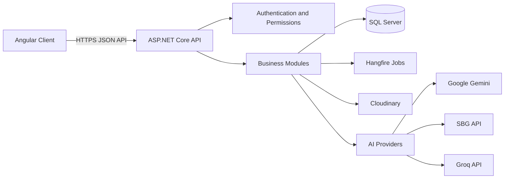

# PhysioAssist

PhysioAssist is an AI-assisted physiotherapy management platform for clinics and rehabilitation teams. It brings patient intake, clinical sessions, scheduling, documentation, reporting, and patient communication into one web application.

The system combines an Angular web client with an ASP.NET Core Web API and SQL Server persistence. AI services help clinicians turn recordings and free text into searchable transcripts, structured clinical notes, summaries, scheduling preferences, and bilingual responses.

## Contents

- [Highlights](#highlights)
- [Architecture](#architecture)
- [Main Features](#main-features)
- [AI Capabilities](#ai-capabilities)
- [Repository Structure](#repository-structure)
- [Technology Stack](#technology-stack)
- [Prerequisites](#prerequisites)
- [Configuration and Secrets](#configuration-and-secrets)
- [Running Locally](#running-locally)
- [Database](#database)
- [API and Background Jobs](#api-and-background-jobs)
- [Testing and Build](#testing-and-build)
- [Security Notes](#security-notes)
- [Development Notes](#development-notes)

## Highlights

- Clinic dashboard for operational and clinical activity.
- Patient records, archives, preferred time slots, and doctor-patient assignments.
- Public and authenticated intake workflows.
- Initial reports with audio transcription, attachments, and patient-friendly summaries.
- Session management with audio, attachments, transcription, semantic chunks, and embeddings.
- AI-generated progress notes, session summaries, and multi-session rollup documentation.
- Appointment booking, working schedules, scheduling preferences, guests, and receptionist scheduling.
- English and Arabic medical vocabulary suggestions and answer translation.
- Role- and permission-based access control for staff workflows.
- JWT authentication, Google onboarding support, refresh tokens, OTP records, and email notifications.
- PDF and QR-code services, Cloudinary image hosting, Swagger/OpenAPI, Serilog logging, and Hangfire jobs.

## Architecture



### Frontend

The `Client` application is an Angular 21 single-page application. Routes are lazy-loaded and protected with authentication and permission guards. PrimeNG, Tailwind CSS, RxJS, and standalone Angular components provide the application UI.

### Backend

`PhysioAssist.Api` is an ASP.NET Core Web API targeting .NET 10. It uses feature-oriented modules, dependency injection, Entity Framework Core, ASP.NET Core Identity, SQL Server, FluentValidation, Mapster, Serilog, and Swagger.

### Persistence

`ApplicationDbContext` extends ASP.NET Core Identity's EF Core context. It stores users and clinic staff alongside patients, intake data, reports, packages, sessions, transcription chunks, schedule data, documentation, and notifications. Auditable entities record the creating and updating user where available.

## Main Features

### Authentication and staff management

- Registration, login, refresh-token handling, and account management.
- Google authentication/onboarding support.
- OTP and email-based workflows.
- Doctor, receptionist, clinic, and user management.
- Permission-aware navigation and API authorization.

### Dashboard

The doctor dashboard provides a central view of clinic activity and operational information. Access is controlled by the `Dashboard:Read` permission.

### Patient management

- Create, view, update, archive, and search patient records.
- Associate patients with doctors.
- Store patient scheduling preferences.
- Review patient documentation and treatment history.

### Intake and initial reports

- Authenticated intake management for clinic staff.
- Public intake routes for patient-facing forms.
- Configurable patient form schemas.
- Initial patient reports and report attachments.
- Audio-based assessment transcription.
- Patient-friendly summaries of clinical findings.

### Sessions and clinical documentation

- Create and manage therapy sessions.
- Attach session audio and other files.
- Transcribe recordings and process transcripts into semantic chunks.
- Generate progress-note drafts with subjective, objective, assessment, and plan content.
- Generate individual session summaries.
- Generate patient-level, multi-session rollup summaries.
- Configure clinic documentation preferences and templates.

### Scheduling

- Manage appointments and schedule slots.
- Define clinician working schedules.
- Store doctor scheduling preferences.
- Parse patient availability expressed in natural language.
- Support receptionist-assisted scheduling and guest records.
- Provide today-session and schedule-preference views in the client.

### Packages and treatment plans

- Manage treatment schedule plans.
- Track patient session packages.
- Record doctor assignment history for packages.

### Search and patient communication

- Search clinical session content semantically using transcript embeddings.
- Query clinical information through the query module.
- Translate clinical answers into Arabic while preserving medical terminology.
- Offer English and Arabic autocomplete with general and physiotherapy-specific vocabulary.

### Supporting services

- PDF generation through QuestPDF.
- QR-code generation and signed QR tokens.
- Cloudinary-backed image hosting.
- Email and Brevo integration points.
- In-app notifications.
- Hangfire dashboard and recurring background cleanup of expired or revoked refresh tokens.

## AI Capabilities

PhysioAssist uses interface-based AI services so providers can be replaced through dependency-injection configuration.

| Capability               | Purpose                                               | Current integration                                    |
| ------------------------ | ----------------------------------------------------- | ------------------------------------------------------ |
| Autocomplete             | Prefix suggestions for general and medical vocabulary | Local English and Arabic Trie indexes                  |
| Audio transcription      | Convert session or assessment recordings to text      | Google Gemini multimodal API                           |
| Embeddings               | Represent transcript chunks for semantic search       | Google Gemini embeddings, stored as SQL Server vectors |
| Transcript chunking      | Split transcripts into meaningful clinical segments   | SBG active implementation, Groq alternative            |
| Documentation extraction | Draft structured findings and clinical notes          | SBG active implementation, Groq alternative            |
| Patient summaries        | Explain clinical reports in patient-friendly language | Groq                                                   |
| Session summaries        | Produce concise summaries of individual sessions      | SBG active implementation                              |
| Rollup summaries         | Synthesize progress across multiple sessions          | SBG active implementation                              |
| Time parsing             | Extract availability and constraints from free text   | SBG active implementation, Groq alternative            |
| Translation              | Translate clinical answers between English and Arabic | SBG active implementation, Nvidia alternative          |

### AI processing flow

1. A session recording is uploaded.
2. Gemini transcribes the audio.
3. The transcript is split into semantic chunks.
4. Each chunk is embedded and stored for similarity search.
5. Documentation services draft progress notes and summaries.
6. Clinicians review and use the generated content in the patient record.

AI output is assistive content and should be reviewed by an appropriately qualified clinician before it is used for care, communication, or official documentation.

## Repository Structure

```text
PhysioAssist/
|-- Client/                         # Angular web application
|   |-- public/                     # Public client assets
|   `-- src/app/
|       |-- Core/                   # Guards, interceptors, and shared application services
|       |-- Features/               # Dashboard, intake, patients, sessions, scheduling, etc.
|       |-- Layout/                 # Main authenticated layout and navigation
|       `-- Shared/                 # Reusable components and utilities
|-- PhysioAssist.Api/               # ASP.NET Core Web API
|   |-- Infrastructure/             # AI, storage, email, PDF, QR, and provider integrations
|   |-- Modules/                    # Auth, patients, intake, sessions, scheduling, documentation, etc.
|   |-- Persistence/                # DbContext and EF Core migrations
|   |-- Shared/                     # Entities, DTOs, interfaces, options, errors, and repositories
|   `-- Data/                       # Autocomplete vocabulary files
|-- AI_FEATURES_SUMMARY.txt        # Extended AI architecture notes
`-- PhysioAssist.slnx               # .NET solution file
```

## Technology Stack

### Client

- Angular 21
- TypeScript 5.9
- Angular Router and Reactive Forms
- PrimeNG and PrimeIcons
- Tailwind CSS 4
- RxJS
- Vitest through Angular CLI
- DOMPurify and Marked for sanitized Markdown rendering

### API

- ASP.NET Core and .NET 10
- Entity Framework Core 10 with SQL Server
- ASP.NET Core Identity and JWT Bearer authentication
- Microsoft Semantic Kernel
- Swagger/OpenAPI and Swashbuckle
- FluentValidation and Mapster
- Hangfire with SQL Server storage
- Serilog
- QuestPDF, QRCoder, Cloudinary, MailKit, and Brevo integrations

## Prerequisites

- .NET 10 SDK
- Node.js and npm compatible with the Angular 21 toolchain
- SQL Server
- API credentials for the providers and services enabled in your environment
- Optional: Visual Studio, VS Code, or another IDE with Angular and .NET support

## Configuration and Secrets

Do not commit passwords, API keys, signing keys, database credentials, or provider tokens. Use ASP.NET Core user-secrets for local development and environment variables or a managed secret store in deployed environments.

The API configuration includes sections for:

- `ConnectionStrings:DefaultConnection`
- `ConnectionStrings:HangfireConnection`
- `Jwt`
- `GoogleOptions`
- `Cloudinary`
- `MailSettings` and `Brevo`
- `Gemini`
- `SbgChunkingModelOptions`
- `SbgDocumentationChatOptions`
- `SbgTimeParserChatOptions`
- `SbgTranslationChatOptions`
- `GeminiEmbeddingOptions`
- `GroqPatientSummary`
- `AllowedOrigins`
- `QR` and `QrSettings`
- `FrontendSettings`

For local user-secrets, from the API project directory:

```powershell
dotnet user-secrets init
dotnet user-secrets set "ConnectionStrings:DefaultConnection" "<sql-server-connection-string>"
dotnet user-secrets set "ConnectionStrings:HangfireConnection" "<sql-server-connection-string>"
dotnet user-secrets set "Jwt:Key" "<long-random-signing-key>"
dotnet user-secrets set "Gemini:ApiKey" "<gemini-api-key>"
dotnet user-secrets set "SbgDocumentationChatOptions:Token" "<sbg-token>"
```

Add only the keys required by the providers enabled in your environment. Keep `AllowedOrigins` aligned with the client URL. The Angular environments currently point to `https://localhost:7097/api/` for the API and `http://localhost:4200` for local development.

## Running Locally

### 1. Restore backend dependencies and apply migrations

From the repository root:

```powershell
dotnet restore .\PhysioAssist.slnx
dotnet ef database update --project .\PhysioAssist.Api --startup-project .\PhysioAssist.Api
```

If the EF tool is not installed:

```powershell
dotnet tool install --global dotnet-ef
```

### 2. Start the API

```powershell
dotnet run --project .\PhysioAssist.Api
```

The API exposes Swagger in development. The client environment is configured for `https://localhost:7097`; use the URL printed by the API if the launch profile selects a different port.

Useful backend endpoints include:

- Swagger UI: `/swagger`
- Hangfire dashboard: `/jobs`
- API base path: `/api`
- Autocomplete: `/api/autocomplete/suggest?prefix=<text>&limit=8`

The Hangfire dashboard is protected by its configured dashboard credentials. Change development credentials before sharing an environment.

### 3. Start the Angular client

```powershell
Set-Location .\Client
npm install
npm start
```

Open `http://localhost:4200/`. The authenticated application is under `/app`; public intake routes are under `/public`.

## Database

The API uses EF Core migrations located in `PhysioAssist.Api/Persistence/Migrations`. The database includes identity data and domain data for:

- Clinics, doctors, receptionists, users, OTP entries, and refresh tokens.
- Patients, doctor-patient relationships, archives, and preferred time slots.
- Intake form schemas, pre-visit intakes, and intake access records.
- Initial reports and attachments.
- Treatment plans, patient packages, and assignment history.
- Sessions, recordings/attachments, transcriptions, and transcript chunks.
- Appointments, schedule slots, working schedules, guests, and doctor preferences.
- Documentation templates, clinic preferences, progress notes, summaries, and notifications.

The application seeds data during startup through its data seeding services. Review the seeders before using a shared or production database.

## API and Background Jobs

The API is organized into controllers and services by business capability:

- `Auth`: account, authentication, users, and receptionist administration.
- `DashboardModule`: doctor dashboard data.
- `DocumentationModule`: templates, progress notes, session summaries, and patient documentation.
- `InitialReportModule`: initial reports and report processing.
- `Intake`: authenticated and public intake operations.
- `PackageModule`: treatment plans and patient packages.
- `PatientModule`: patient records and patient-related workflows.
- `QueryModule`: clinical query and answer translation integrations.
- `Scheduling`: appointments, guests, working schedules, and scheduling preferences.
- `SessionModule`: therapy session lifecycle and session ingestion.

Swagger configures Bearer authentication for testing protected endpoints. Obtain a valid JWT through the authentication workflow and authorize it in Swagger before calling protected operations.

Hangfire uses SQL Server storage and registers a recurring job to purge expired or revoked refresh tokens daily.

## Testing and Build

### Client

```powershell
Set-Location .\Client
npm test
npm run build
```

The Angular project uses Vitest through the Angular CLI. End-to-end testing is not currently configured by Angular CLI; add a project-specific runner before relying on `ng e2e`.

### API

```powershell
dotnet build .\PhysioAssist.slnx
```

The repository currently contains the API project and client tests. Add or run a dedicated API test project when expanding backend coverage.

## Security Notes

- Treat all AI-generated notes, summaries, translations, and extracted scheduling data as drafts requiring human review.
- Use HTTPS in development and production where possible.
- Replace all placeholder or development secrets before deployment.
- Rotate any credential that has ever been committed to a repository or shared outside a secret manager.
- Restrict CORS origins to trusted client URLs.
- Use strong, unique JWT and QR signing keys.
- Protect the Hangfire dashboard with strong credentials and restrict access by network or environment policy.
- Avoid logging sensitive clinical data and disable sensitive-data logging outside local development.
- Review Cloudinary, email, database, and AI-provider retention policies for healthcare data requirements.

## Development Notes

- Add new backend capabilities inside the relevant module and register services through dependency injection.
- Keep provider-specific AI clients behind shared interfaces so providers can be changed without changing business modules.
- Add configuration options with validation and fail fast when required settings are missing.
- Apply EF Core migrations for schema changes and verify seed behavior against a non-production database.
- Use the existing permission guards and API authorization policies for new protected workflows.
- Keep patient and clinical data out of source control, logs, screenshots, fixtures, and test output.

## License

No license file is currently included in the repository. Add a license before distributing PhysioAssist outside its owning organization.
